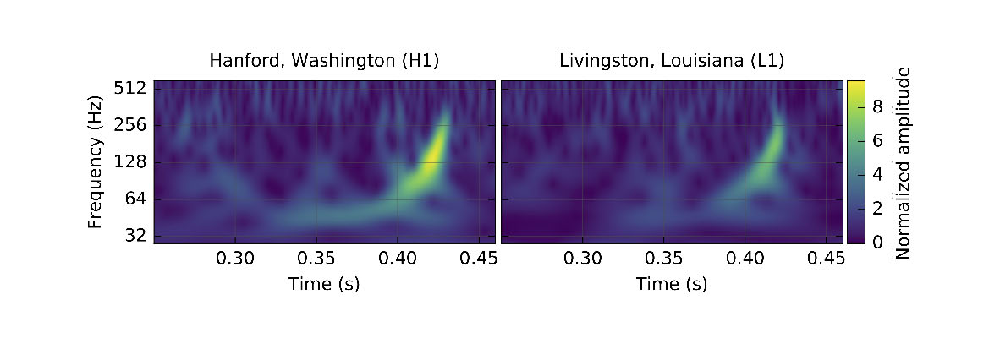
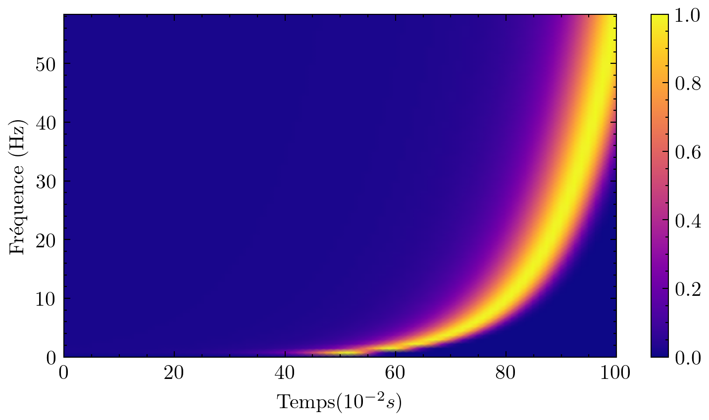

# Gravitational Waves
## Introduction
On s'intéresse ici à un système binaire d'astres, typiquement deux etoiles à neutrons. Il va être question de regarder les propriétés des ondes gravitationnelles qui résultent du mouvement. \\
Le but de ce travail est d'essayer de comprendre les resultats experimentaux de detection comme celui de Ligo en 2016.

On pourra alors propser plusieurs modèles pour comprendre le phénomène.

## Mécanique classique
On applique un principe fondamental de la dynamique à l'un des deux astres en projection sur $\overrightarrow{e_r}$ et $\overrightarrow{e_\theta}$:
$$\ddot{r} - rw^2 = -\frac{GM}{r^2} \mbox{ et } 2 \dot{r}w + r \dot{w} = 0$$
Ainsi, on a après réarrangement :
$$2 \frac{dr}{r} = -\frac{dw}{w}$$
D'ou finalement :
$$w = \frac{r_{0}^2 w_0}{r^2} \mbox{ avec } w_0 = \sqrt{\frac{GM}{4r_{0}^2}}$$
On remplace alors dans le PFD et on obtient :
$$\ddot{r} r^3 - r_{0}^4 w_{0}^2 = - rGM$$

### Méthode des perturbations
Pour simplifier la résolution, on utilise la méthode des perturbations. On pose alors :
$$r = r_0 e^{-\epsilon} \mbox{ avec } \epsilon \ll 1$$
Ainsi, on a l'approximation :
$$r = r_0 (1-\epsilon)$$
On remplace alors dans l'equation (4) et on linéarise. On obtient finalement :
$$\ddot{\epsilon} + 4w_{0}^2 \epsilon = 3w_{0}^2$$
On résout aves les conditions $\epsilon (0) = 0$ et $\dot{\epsilon} (0) = 0$ et on trouve finalement en revenant à $r$ :
$$r(t) = r_0 e^{\frac{3}{4}(cos(2w_0 t) - sin(2w_0 t) - 1)}$$
On remplace dans l'expression (3) et on a finalement :
$$f(t) = f_0 e^{-\frac{3}{2}(cos(2w_0 t) - sin(2w_0 t) - 1)} \mbox{ avec } f_0 = \frac{w_0}{2 \pi}$$

On peut alors tracer le résultat du modèle :

